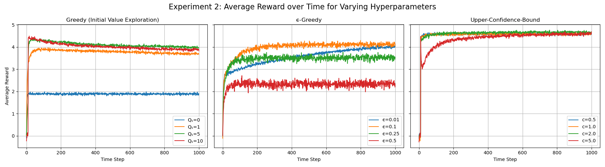

# Multi-Armed Bandit: Action Selection Methods

This project compares the performance of three action selection strategies in a **k-armed bandit problem**:

- **Greedy**
- **ε-Greedy**
- **Upper Confidence Bound (UCB)**

The goal is to evaluate how each algorithm performs over time in terms of **average reward**.

## Experiment 1 Setup: Base Multi-Armed Bandits

- **Number of actions**: 10
- **Time steps per run**: 1000
- **Total runs**: 1000
- **Initial estimated value (Q₁)**: 5 for all actions
- **ε (epsilon for exploration)**: 0.1
- **c (UCB exploration parameter)**: 2

## Experiment 2 Setup: Hyperparameter Sensitivity in Multi-Armed Bandits

This experiment investigates how varying key hyperparameters influences the performance of three different action selection strategies in a 10-armed bandit problem.

- **Number of actions**: 10  
- **Timesteps per run**: 1000  
- **Total runs (averaged)**: 1000  

Each algorithm was tested using a range of hyperparameter values:

- **Greedy initial action-value estimate (Q₁)**:  
  `0`, `1`, `5`, and `10`.

- **ε-Greedy epsilon (ϵ) parameter**:  
  `0.01`, `0.1`, `0.25`, and `0.5`.

- **Upper Confidence Bound (UCB) confidence parameter (c)**:  
  `0.5`, `1`, `2`, and `5`.
