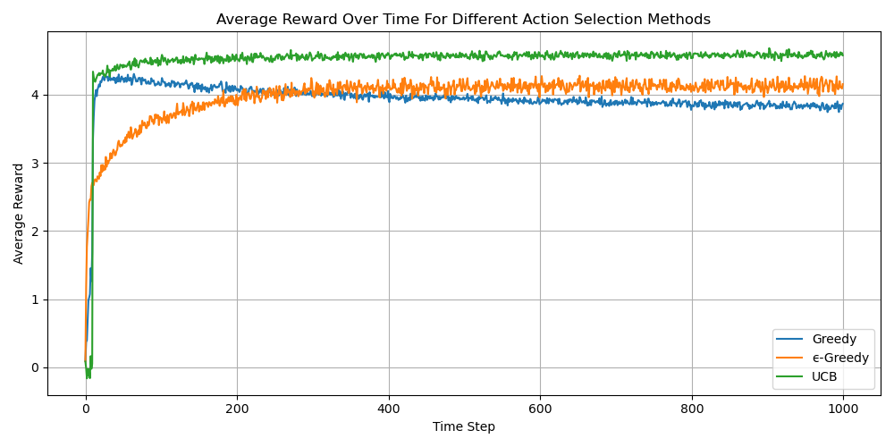

# Multi-Armed Bandit: Action Selection Methods



This project compares the performance of three action selection strategies in a **k-armed bandit problem**:

- **Greedy**
- **ε-Greedy**
- **Upper Confidence Bound (UCB)**

The goal is to evaluate how each algorithm performs over time in terms of **average reward**.

## Experiment 1 Setup

- **Number of actions**: 10
- **Time steps per run**: 1000
- **Total runs**: 10,000
- **Initial estimated value (Q₁)**: 5 for all actions
- **ε (epsilon for exploration)**: 0.1
- **c (UCB exploration parameter)**: 2

## Experiment 2 Setup
    ***
    ***
    ***

## How It Works

1. A `Run` environment simulates the reward distribution and tracks average rewards.
2. For each run:
   - All algorithms start with the same initial conditions.
   - At each time step, each algorithm selects an action.
   - The environment returns a reward for that action.
   - The algorithm updates its estimates based on the received reward.
3. After all runs, average rewards are computed and plotted.

## Output

A line graph visualizes the average reward over time for each strategy, helping compare their performance.

## 🧰 Requirements

- Python 3.x
- `numpy`
- `matplotlib`

Install with:

```bash
pip install numpy matplotlib
